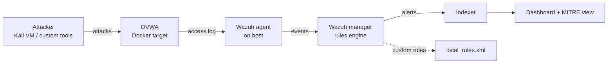

# detection-lab

A self-hosted **detection engineering lab** built on a single laptop. Deliberately
vulnerable web applications are attacked from an isolated attacker VM, the
resulting traffic is collected in a SIEM, and **custom detection rules — authored
from scratch — turn those attacks into alerts**, each mapped to MITRE ATT&CK and
documented with its false positives and blind spots.

The goal was never to demonstrate exploitation (the targets are trivially
vulnerable by design). It was to demonstrate the full detection loop: run a
technique, find its trace in the logs, write the rule that catches it, tune out
the noise, and honestly record what the rule cannot see.

## What this shows

- **Four custom Wazuh detection rules**, authored by hand — not default rules.
- Coverage of **both detection paradigms**: content matching and frequency
  correlation.
- Each rule **mapped to MITRE ATT&CK** and documented with design reasoning,
  false positives, and limitations.
- A working, reproducible **SIEM pipeline** from attack to alert on constrained
  hardware.

## Detections

| Detection | Technique | Rule | Approach | Status |
|-----------|-----------|------|----------|--------|
| [SQL Injection (UNION)](detections/sqli-union.md) | T1190 | 100200 | Escalate default on confirmed data extraction | Validated |
| [Command Injection](detections/command-injection.md) | T1059 | 100400 | Fill a gap the default ruleset silenced | Validated |
| [Cross-Site Scripting](detections/xss.md) | T1059.007 | 100500 | Escalate default on concrete signature | Validated |
| [Login Brute Force](detections/brute-force.md) | T1110 | 100600 / 100601 | Frequency correlation (6 attempts / 30s / same IP) | Validated |

Rule definitions: [`rules/local_rules.xml`](rules/local_rules.xml).

## Architecture



All components run on one 16 GB laptop under KVM/QEMU and Docker. The lab runs in
scenarios rather than all at once, by design — see the phase docs for the RAM
budget behind each.

## Phases

| Phase | Focus | Status |
|-------|-------|--------|
| [0 — Hypervisor foundation](docs/phase-0-hypervisor.md) | KVM/QEMU, libvirt, storage pool, NAT network, first VM | Complete |
| [1 — Targets](docs/phase-1-targets.md) | Docker on host, DVWA, isolated lab network | Complete |
| [2 — Attack & telemetry](docs/phase-2-attacks.md) | Four web attacks, payloads and timing recorded | Complete |
| [3 — Wazuh SIEM & detection](docs/phase-3-wazuh.md) | SIEM deployed, four custom rules authored and validated | Complete |

## Repository layout

```
detection-lab/
├── README.md
├── docs/            Per-phase build logs (the journey + rebuild steps).
├── detections/      Per-rule case files: attack, evidence, rule, tuning, limits.
├── rules/           The Wazuh XML rule definitions.
├── tools/           Custom tooling (e.g. brute.py).
└── evidence/        Screenshots (MITRE coverage dashboard, alerts).
```

## Environment

| | |
|---|---|
| Host | Lenovo IdeaPad Gaming 3 16IAH7 |
| OS | Arch Linux (`linux-zen`), Hyprland |
| RAM | 16 GB |
| Hypervisor | KVM/QEMU via libvirt |
| SIEM | Wazuh 4.14 (single-node, Docker) |
| Target | DVWA (Docker) |

## Scope and future work

This lab is deliberately scoped to **web-application attack detection** — a
complete, self-contained slice of detection engineering. Two extensions are
planned as future work, gated on hardware:

- **Endpoint detection (Windows + Sysmon + Atomic Red Team)** — process-level
  telemetry and rules for host-based techniques. This is where most enterprise
  SOC detection lives; deferred pending a RAM upgrade (Windows + SIEM together
  exceeds a comfortable footprint on 16 GB).
- **Cowrie honeypot** — a custom Wazuh decoder and ruleset for real attacker
  traffic, run on always-on hardware.

## A note on limitations

Detection quality is capped by log quality, and every rule is a trade-off between
coverage and false positives. Where a rule cannot cleanly separate an attack from
legitimate activity — or cannot see the attack at all — that is documented rather
than hidden. See the per-detection "What this misses" sections, and the
consolidated [limitations writeup](docs/limitations.md).
