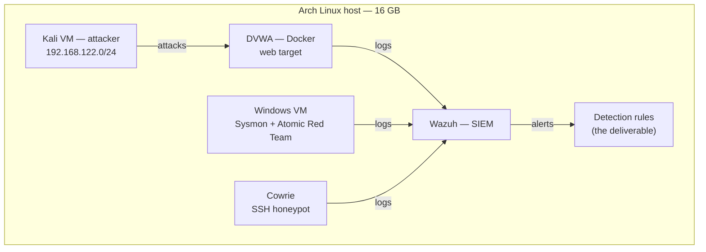

# detection-lab

A self-hosted detection engineering lab built on a single laptop. Attacks are
run against deliberately vulnerable targets, the resulting telemetry is
collected in a SIEM, and detection rules are written by hand to catch each
technique — then tuned to remove false positives.

The objective is not to demonstrate exploitation. It is to demonstrate the full
loop from adversary action to alert: running a technique, finding its trace in
the logs, authoring a detection rule, mapping it to MITRE ATT&CK, and honestly
recording what could not be detected.

## Architecture



The lab runs in scenarios rather than all at once — 16 GB of RAM does not permit
every component to run simultaneously. See the phase documents for the RAM
budget behind each scenario.

## Phases

| Phase | Focus | Status |
|-------|-------|--------|
| [0 — Hypervisor foundation](docs/phase-0-hypervisor.md) | KVM/QEMU, libvirt, storage pool, NAT network, first VM | Complete |
| [1 — Targets](docs/phase-1-targets.md) | Docker on host, DVWA, lab network reachability | Complete |
| [2 — Attack & telemetry](docs/phase-2-attacks.md) | Run web attacks, record payloads and timestamps | In progress |
| [3 — Wazuh SIEM](docs/phase-3-wazuh.md) | Deploy SIEM, enroll agents, map coverage gaps | Planned |
| [4 — Endpoint detection](docs/phase-4-windows.md) | Windows, Sysmon, Atomic Red Team, rule authoring | Planned |
| [5 — Honeypot](docs/phase-5-cowrie.md) | Cowrie, custom Wazuh decoder and ruleset | Planned |
| [6 — Documentation](docs/phase-6-docs.md) | Rebuild guide, diagrams, limitations writeup | Ongoing |

## Detections

Each detection is documented as a self-contained case: the attack that triggers
it, the raw log evidence, the rule, the ATT&CK mapping, and false-positive
tuning notes.

| Detection | Technique | Rule | Status |
|-----------|-----------|------|--------|
| [SQL Injection (UNION)](detections/sqli-union.md) | T1190 | 100200 | Validated |
| [Command Injection](detections/command-injection.md) | T1059 | 100400 | Validated |
| [Cross-Site Scripting](detections/xss.md) | T1059.007 | 100500 | Validated |
| [Login Brute Force](detections/brute-force.md) | T1110 | 100600/601 | Validated |

## Repository layout

```
detection-lab/
├── README.md                  This file.
├── docs/                      Per-phase build logs (the journey).
│   ├── phase-0-hypervisor.md
│   └── _phase-template.md     Copy this to start a new phase.
├── detections/                Per-rule case files (the product).
│   └── _detection-template.md Copy this to document a new rule.
├── rules/                     Wazuh XML rule definitions.
└── evidence/                  Screenshots and raw log captures.
```

## Environment

| | |
|---|---|
| Host | Lenovo IdeaPad Gaming 3 16IAH7 |
| OS | Arch Linux (`linux-zen`, `nvidia-open-dkms`) |
| RAM | 16 GB DDR4-3200 |
| Hypervisor | KVM/QEMU via libvirt |
| VM storage | Dedicated 301 GB partition at `/mnt/vms` |

## A note on scope

This lab was built on constrained hardware by design. Some techniques generate
no usable telemetry in this environment, and some detections cannot be reliably
separated from normal activity. Those cases are documented rather than omitted —
see the limitations section in [Phase 6](docs/phase-6-docs.md). Knowing what a
detection cannot see is part of the discipline.
