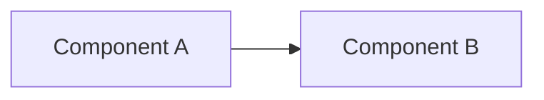

# Phase N — [Title]

**Status:** [Planned | In progress | Complete]
**Goal:** [One sentence: what this phase builds and why it matters to the lab.]

## Summary

[2–4 sentences a non-technical reader can follow. What got built, what it
proves. This is the part a hiring manager reads and leaves satisfied — write it
last, once the phase is done, and keep it plain.]

## Architecture

[The end state of this phase. Prefer a Mermaid diagram so it renders on GitHub
and stays in version control. Delete this block if the phase adds nothing to the
topology.]



## Build steps

[The reproducible walkthrough — full commands, in order, enough for a stranger
to rebuild this exactly. Group related commands under short prose that says what
each block does and why. This is the "engineer who'd actually rebuild it"
reader.]

```bash
# commands here
```

## Problems hit

[The most valuable section. Every gotcha, as: symptom → cause → fix. This is
where competence shows — anyone can paste a tutorial that worked first try;
documenting what broke and how it was diagnosed is the differentiator. Also
where future-you looks first to remember why something was done a certain way.
Leave empty only if genuinely nothing went wrong.]

**[Short description of the problem].**
[Symptom observed, the cause once diagnosed, and the fix applied.]

## Verification

[How completion was confirmed — the check commands and their expected output.
Proves the phase actually works rather than asserting it does.]

```bash
# verification commands with expected results as comments
```
