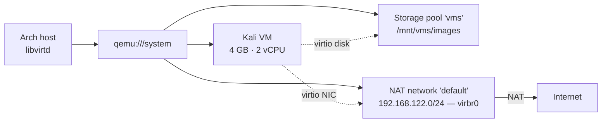

# Phase 0 — Hypervisor Foundation

**Status:** Complete
**Goal:** Stand up a working KVM/QEMU virtualisation stack on the Arch host —
storage pool, NAT network, and a first attacker VM (Kali) — as the foundation
every later phase builds on.

## Summary

Installed and configured KVM/QEMU with libvirt on Arch Linux. Created a storage
pool backed by a dedicated 301 GB partition, a NAT network for VM connectivity,
and imported a prebuilt Kali image as the lab's attacker machine. Confirmed
hardware acceleration is active and captured a clean snapshot of Kali as a
rollback point. The result is a reproducible base layer: any VM in later phases
is defined against this pool and network.

## Architecture

State of the system at the end of this phase:



## Build steps

Confirm hardware virtualisation is available. A line containing `vmx` (Intel)
must be present:

```bash
lscpu | grep -E "vmx|svm"
```

Refresh the package database and fully upgrade before installing — this avoids
stale-mirror failures (see Problems hit). A kernel update here will trigger a
DKMS rebuild of the NVIDIA module; reboot afterwards.

```bash
sudo pacman -Syu
```

Install the virtualisation stack:

```bash
sudo pacman -S qemu-full libvirt virt-manager virt-viewer dnsmasq \
               iptables-nft edk2-ovmf swtpm
```

- `qemu-full` — the emulator, device models, and image tooling
- `libvirt` — management daemon that virt-manager and `virsh` talk to
- `dnsmasq` — DHCP/DNS for the virtual networks
- `iptables-nft` — required for libvirt NAT (replaces `iptables` when prompted)
- `edk2-ovmf`, `swtpm` — UEFI firmware and emulated TPM, needed for Windows later

Enable the daemon and grant the user access:

```bash
sudo systemctl enable --now libvirtd.service
sudo usermod -aG libvirt danish
```

Log out of the desktop session and back in for the group change to apply, then
confirm unprivileged access:

```bash
groups | grep libvirt
virsh list --all        # empty table, no password prompt
```

Set the default connection URI to the system instance. Without this, `virsh`
defaults to `qemu:///session`, which is unprivileged and cannot create network
bridges:

```bash
mkdir -p ~/.config/libvirt
echo 'uri_default = "qemu:///system"' > ~/.config/libvirt/libvirt.conf
```

Verify in a new shell:

```bash
virsh uri               # → qemu:///system
```

Create the storage pool on the dedicated partition. Confirm the partition is
mounted first, so images do not silently land on the root partition:

```bash
mount | grep /mnt/vms   # expect /dev/nvme0n1p8 on /mnt/vms
sudo mkdir -p /mnt/vms/images
sudo chown -R danish:danish /mnt/vms

virsh pool-define-as vms dir --target /mnt/vms/images
virsh pool-autostart vms
virsh pool-start vms
virsh pool-list --all   # vms — active — yes
```

Define the NAT network. Newer Arch libvirt packages do not ship a default
network XML, so it is written by hand:

```bash
cat > /tmp/default-net.xml << 'EOF'
<network>
  <name>default</name>
  <forward mode='nat'/>
  <bridge name='virbr0' stp='on' delay='0'/>
  <ip address='192.168.122.1' netmask='255.255.255.0'>
    <dhcp>
      <range start='192.168.122.2' end='192.168.122.254'/>
    </dhcp>
  </ip>
</network>
EOF

virsh net-define /tmp/default-net.xml
virsh net-start default
virsh net-autostart default
virsh net-list --all    # default — active — yes — yes
```

Import the Kali VM from the prebuilt QEMU image. The image is extracted from the
official `.7z`, renamed for convenience, and placed in the pool directory:

```bash
virt-install \
  --name kali \
  --memory 4096 \
  --vcpus 2 \
  --disk /mnt/vms/images/kali.qcow2,bus=virtio \
  --import \
  --os-variant debian12 \
  --network network=default,model=virtio \
  --graphics spice \
  --video qxl \
  --noautoconsole
```

After first boot: change the default `kali:kali` credentials, run
`sudo apt update && sudo apt full-upgrade -y`, shut down, and snapshot:

```bash
virsh snapshot-create-as kali clean-install "Fresh Kali, fully updated"
```

## Problems hit

**Stale package mirrors caused a 404 on install.**
The first `pacman -S` for the virtualisation stack failed with 404 errors across
every mirror for a `gst-plugins-good` dependency. The local package database was
out of date and referencing a version that had already been superseded and
removed from mirrors. Running `sudo pacman -Syu` first — a full sync and
upgrade — resolved it. Installing packages after only `-Sy` (partial upgrade) is
the underlying trap and was avoided.

**Kernel update mid-upgrade required a reboot before devices behaved.**
The `-Syu` pulled a new `linux-zen` kernel, which rebuilt the `nvidia-open-dkms`
module against it. Until reboot, the running kernel's module directory no longer
matched what was on disk, which produces confusing device-level failures. Reboot
immediately after any upgrade that touches the kernel.

**A `mkdir` typo created a stray directory and broke the pool start.**
`pool-start` failed with `cannot open directory '/mnt/vms/images': No such file
or directory`. The earlier `mkdir` had been run as `/mnt/images` instead of
`/mnt/vms/images`, creating an empty directory in the wrong place. Removed the
stray directory, recreated the correct path, and re-ran the pool start. Tab
completion on long paths prevents this.

**Bridge creation failed with "Operation not permitted" — the key issue.**
`virsh net-start default` failed to create `virbr0`. The cause was a
session-versus-system URI mismatch: `virsh` was connecting to `qemu:///session`,
which runs unprivileged and cannot create network bridges. The storage pool had
worked earlier only because writing to a user-owned directory needs no
privileges, which masked the problem. Fixed by setting
`uri_default = "qemu:///system"`.

**A quoting mistake wrote a malformed libvirt.conf.**
The first attempt to set the URI was written as
`echo 'uri_default' = 'qemu:///system'`, which the shell split incorrectly and
wrote a line libvirt could not parse — every subsequent `virsh` command then
failed with a config syntax error. Corrected to a single properly quoted line,
`echo 'uri_default = "qemu:///system"'`, using `>` to overwrite the broken file
rather than `>>` to append to it.

**libvirt objects are per-URI.**
After switching to the system URI, both the storage pool and the network defined
earlier under the session URI were invisible. The network turned out to already
exist at the system level (defined by the package), but the pool had to be
redefined. Objects created under one connection URI do not carry over to another.

## Verification

Hardware acceleration is active — `kvm_intel` loaded and the KVM domain type
advertised:

```bash
lsmod | grep kvm                              # kvm_intel present
virsh capabilities | grep "domain type='kvm'" # domain type='kvm' present
```

Pool and network both active and set to autostart:

```bash
virsh pool-list --all   # vms — active — yes
virsh net-list --all    # default — active — yes — yes
```

Kali boots, receives a DHCP lease on the lab network, and reaches the internet
through NAT:

```bash
# inside the guest
ip a | grep 192.168.122
ping -c 3 8.8.8.8
```

Snapshot exists as a rollback point:

```bash
virsh snapshot-list kali   # clean-install — shutoff
```
