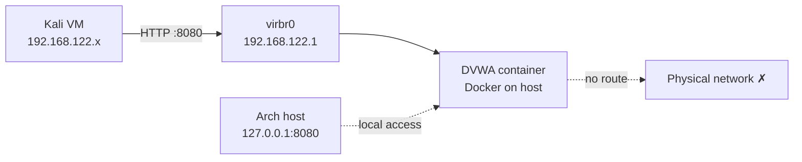

# Phase 1 — Targets

**Status:** Complete
**Goal:** Stand up the lab's first vulnerable target — DVWA in Docker on the host
— and make it reachable from the Kali attacker VM without exposing it to any
external network.

## Summary

Installed Docker on the Arch host and deployed DVWA (Damn Vulnerable Web
Application) as a container. The container is bound only to the loopback address
and the libvirt bridge, so it is reachable from the host and from lab VMs but
never from the physical network. Confirmed Kali can reach DVWA over the isolated
lab network, giving the attacker a target to generate telemetry against in later
phases.

## Architecture



DVWA is deliberately vulnerable, so it is never bound to the host's physical
interface. Binding is restricted to `127.0.0.1` (host access) and
`192.168.122.1` (the libvirt bridge, reachable only by lab VMs).

## Build steps

Install Docker and Compose, enable the service, and add the user to the `docker`
group:

```bash
sudo pacman -S docker docker-compose
sudo systemctl enable --now docker
sudo usermod -aG docker danish
```

Log out of the desktop session and back in for the group change to apply, then
confirm Docker runs without `sudo`:

```bash
docker run --rm hello-world
```

Create a directory for lab compose files and define the DVWA service. The two
port bindings are the important part — loopback for host access, and the libvirt
bridge address for VM access:

```bash
mkdir -p ~/lab/dvwa && cd ~/lab/dvwa

cat > docker-compose.yml << 'EOF'
services:
  dvwa:
    image: vulnerables/web-dvwa
    container_name: dvwa
    ports:
      - "127.0.0.1:8080:80"
      - "192.168.122.1:8080:80"
    restart: unless-stopped
EOF

docker compose up -d
docker ps
```

Complete DVWA's first-run setup through the browser at
`http://192.168.122.1:8080`:

1. Scroll to the bottom of the setup page, click **Create / Reset Database**.
2. Log in with the default `admin` / `password`.
3. Set **DVWA Security** to **Low** so the vulnerabilities are exploitable
   without filtering — the goal is to learn what successful attacks look like in
   logs before raising difficulty.

## Problems hit

**Docker denied access even after adding the user to the group.**
`docker run` failed with a permission error on `/var/run/docker.sock`. Group
membership does not apply to an already-running desktop session — the session
inherits its group list at login. Logging out of the desktop entirely and back
in applied the `docker` group. A new terminal alone is not enough.

**`curl` failed with an SSL error against a plain-HTTP service.**
Testing the container with `curl -I https://127.0.0.1:8080` returned
`SSL routines::wrong version number`. DVWA serves plain HTTP on port 8080; the
`https://` prefix made curl attempt a TLS handshake against a non-TLS service.
Using `http://` resolved it. Browsers can hit the same issue by silently
upgrading to HTTPS, so the `http://` scheme must be explicit.

**DVWA was unreachable from Kali.**
With DVWA initially bound only to `127.0.0.1:8080`, the container was reachable
from the host but not from the Kali VM, which sits on the `192.168.122.0/24` lab
network. Loopback is not routable from the guests. Adding a second port binding
on the libvirt bridge address, `192.168.122.1:8080`, exposed the service to lab
VMs while still keeping it off the physical network. This preserves isolation:
the vulnerable app is reachable only from the host and the lab, never from
outside.

## Verification

Container running with both port bindings present:

```bash
docker ps    # PORTS shows 127.0.0.1:8080->80 and 192.168.122.1:8080->80
```

Reachable from the host — expect a 302 redirect to the login page:

```bash
curl -I http://127.0.0.1:8080
```

Reachable from Kali over the lab network — run inside the guest:

```bash
curl -I http://192.168.122.1:8080    # expect HTTP/1.1 302 Found
```

DVWA login page loads in Kali's browser at `http://192.168.122.1:8080`, and the
attack surface (SQL injection, XSS, command injection, brute force) is available
for Phase 2.
