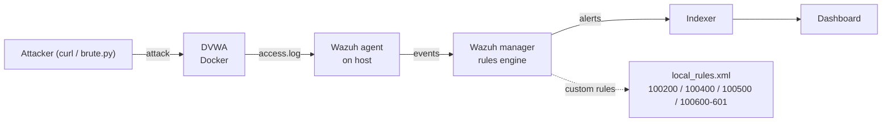

# Phase 3 — Wazuh SIEM & Detection Engineering

**Status:** Complete
**Goal:** Deploy a SIEM, get it ingesting the target's logs, and author custom
detection rules for each Phase 2 attack — turning raw web traffic into alerts a
SOC analyst would act on.

## Summary

Deployed Wazuh (single-node, Docker) and connected it to the DVWA target via a
Wazuh agent reading DVWA's Apache access log. Confirmed the full pipeline —
attack → log → agent → manager → alert — then authored four custom detection
rules, one per Phase 2 attack, each mapped to MITRE ATT&CK and documented with
its design reasoning, false positives, and limitations. The work spans both
major detection paradigms: content matching (SQLi, XSS, command injection) and
frequency correlation (brute force).

The recurring theme is honest: default rules are a starting point, not a
portfolio. Every rule here either escalates a weak default, fills a gap the
default ignored, or detects a pattern no single-event rule could — and every one
is documented with what it *cannot* catch.

## Architecture

## Custom rules authored

| Rule | Attack | Approach | Level | Technique |
|------|--------|----------|-------|-----------|
| 100200 | SQLi (UNION) | Escalate default 31103 on confirmed extraction | 12 | T1190 |
| 100400 | Command injection | Fill gap — override default 31108 that silenced it | 8 | T1059 |
| 100500 | Reflected XSS | Escalate default 31105 on concrete signature | 10 | T1059.007 |
| 100600 / 100601 | Brute force | Frequency: 6 attempts / 30s / same source | 3 / 10 | T1110 |

Full write-ups, evidence, and tuning notes in [`../detections/`](../detections).

## Two detection paradigms

The four rules deliberately cover both families of detection:

- **Content-based** (100200, 100400, 100500) — inspect a single request for a
  malicious signature (`UNION SELECT`, a script tag, a POST to the exec
  endpoint). One event, judged in isolation.
- **Frequency-based** (100600/100601) — a single login attempt is
  indistinguishable from legitimate use; the attack exists only in the *rate*.
  This required chaining a low-severity "counter" rule to a frequency rule using
  `frequency`, `timeframe`, and `same_source_ip`.

## Key findings

**Default rules have real gaps.** Command injection to the exec endpoint matched
a default rule (31108) that *silences* it at level 0 — a genuine blind spot,
closed by a custom override.

**Detection quality is capped by log quality.** Command injection payloads arrive
in the POST body, which Apache's default access log does not record — so the
injected command is invisible to detection. This is the single most important
lesson of the phase: you cannot detect on data that was never logged. Documented
as a limitation with the proper fix (log POST bodies / add mod_security) noted.

**Every rule is a trade-off.** The command-injection rule fires on legitimate
pings (verified live) because it can only see the endpoint, not the payload —
hence level 8 (suspicion), not 12 (confirmation). Severity was set to match
confidence throughout.

## Operational notes (for the rebuild guide)

- Agent and manager **versions must match** (agent ≤ manager). An initial version
  mismatch (agent 4.14.7 vs manager 4.9.0) blocked enrollment; fixed by rebuilding
  the manager at the matching tag.
- **Restarting the manager drops the agent connection.** After any manager
  restart, run `sudo systemctl restart wazuh-agent` and confirm `Active` via
  `agent_control -l`. Symptom of the dropped link: rules match in `wazuh-logtest`
  but never fire on live traffic.
- `wazuh-logtest` needs the **full raw log line** (IP + timestamp prefix), not
  just the request portion, or the decoder won't match.
- Custom rules live in `/var/ossec/etc/rules/local_rules.xml`; IDs use the
  100000+ reserved range. Raw `<`/`>` inside a rule's XML value breaks the
  parser — match encoded forms or bracket-free substrings instead.

## Notes for Phase 4

Web logs prove an attack was *attempted*, not that it *executed*. Confirming
command execution on the server (vs. a mere attempt) requires host-level process
telemetry — Sysmon / auditd watching for processes spawned by the web-server
user. That endpoint-detection work is Phase 4.
